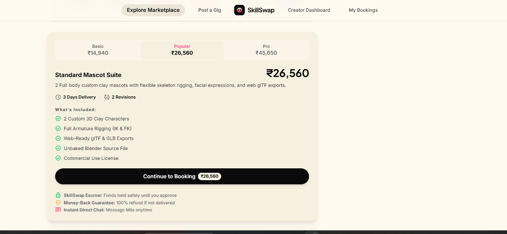
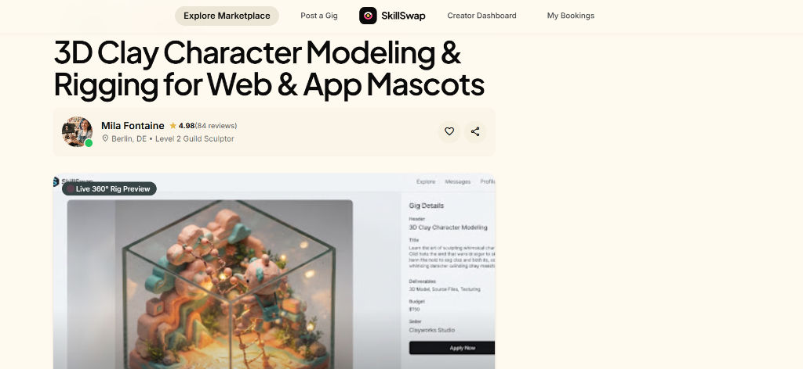
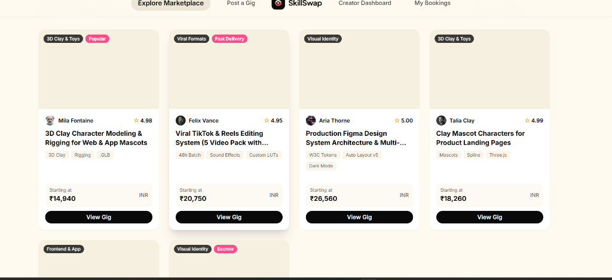
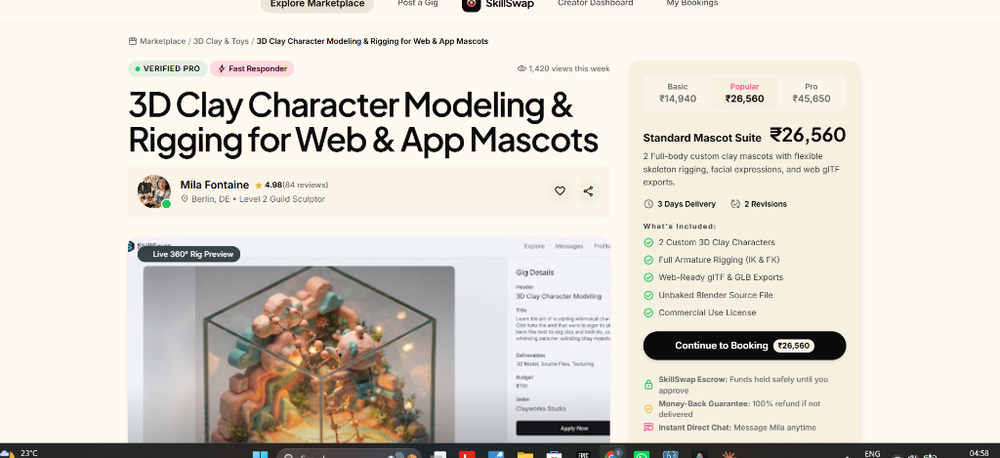

# SkillSwap

**SkillSwap** is a cash-only creator marketplace built for Gen-Z specialists in 3D, motion, and frontend engineering. It connects clients with vetted young talent to ship high-quality work seamlessly and safely.

## Key Features

- **Dynamic Marketplace:** A discoverable feed of creator gigs, ordered by a real-time trending algorithm that factors in bookings, views, and average ratings to surface the best talent.
- **Secure Escrow System:** All project funds are locked safely in escrow before work begins. Creators are guaranteed payment upon successful delivery, while clients are protected from incomplete work.
- **Milestone Tracking:** Complex projects are broken down into trackable steps (e.g., Revisions, Texture Bake). Both sides get full transparency into progress.
- **Creator Dashboard:** A comprehensive command center for creators to manage active pipeline, track escrow balances, view incoming requests, and monitor their "Success Score".
- **Frictionless Onboarding:** No forced logins or complex barriers to browsing. Visitors can explore the marketplace freely, with identification handled via streamlined query parameters for the demo.

## Preview

*SkillSwap Marketplace*

*Publish a Skill Offering*

*Creator Dashboard*

*Live Escrow & Bookings*

## Architecture

- **Frontend:** Static HTML, Vanilla JS, Tailwind CSS. Hydrates dynamic content seamlessly via pi-client.js without a heavy framework.
- **Backend:** Node.js, Express, TypeScript, Prisma, PostgreSQL. Robust transactional ledger for the escrow system.

## Getting Started

### Backend
\\\ash
cd backend
npm install
npm run dev
\\\

### Frontend
\\\ash
npx serve -p 3000 frontend
\\\

## Deployment
- **Frontend & Backend** can both be deployed on [Render.com](https://render.com) using the included \
ender.yaml\ blueprint.
- Requires a PostgreSQL database (e.g., Neon or Supabase).

## Decisions
See [DECISIONS.md](DECISIONS.md) for a living record of architectural choices.
